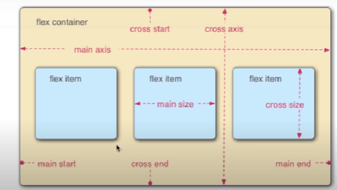

# Flexbox

- flex container: thẻ chứa
- flex item: thẻ con trực tiếp
- main axis: trục chính
- cross axis: vuông góc trục chính
- main size: kích thước của flex item, song song main axis
- cross size: tương tự main size
- main end, main start: chỗ bắt đầu, kết thúc

# Thuộc tính CSS trong flexbox

- display: flex|inline-flex
  -> khai báo sẽ sử dụng layout flexbox
- flex-direction: row|column
  -> thay đổi phương hướng của main axis
- flex-wrap: nowrap | wrap-reverse | wrap
  -> không xún dòng, xuống dòng, reverse: nhảy lên trên
- flex-basis: <length>
  -> set chiều ngang tương ứng với main size
- justify-content: flex-start | flex-end | center | space-between | sapce-around
  -> căn item theo main axis
- justify-self: flex-start| flex-end|center
  -> khi set justify-content cho cha, con được thừa hưởng
- align-content: flex-start | flex-end|center
  -> giống justyfi-content, cùng phương hướng cross size
- align-self: flex-start | flex-end|center
  -> tương tự justify-self
- flex-grow: <number>
  -> tăng main size
- flex-shrink: <number>
  -> thu nhỏ size
- flex: <number>
  -> viết tắt cho grow, shrink
- order: <number>
  -> thay đổi order của item
  - flex-grow : short hand của flex wrap, flex direction

# Games

https://codingfantasy.com/games/flexboxadventure/play
https://flexboxfroggy.com/
http://www.flexboxdefense.com/

# Web tham khảo

https://codepen.io/enxaneta/full/adLPwv/
